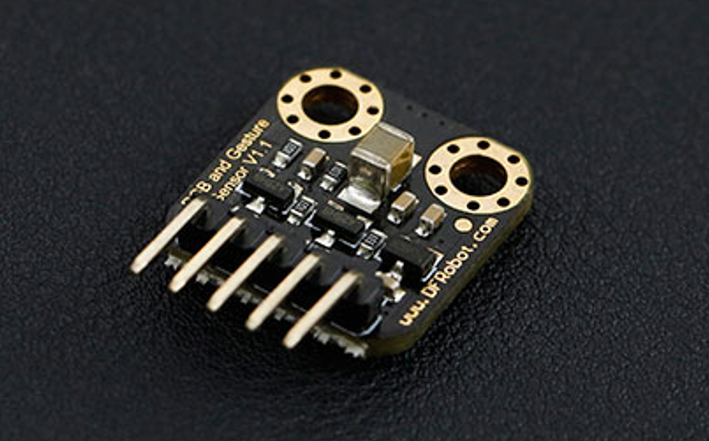
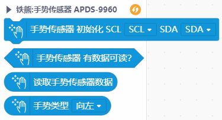
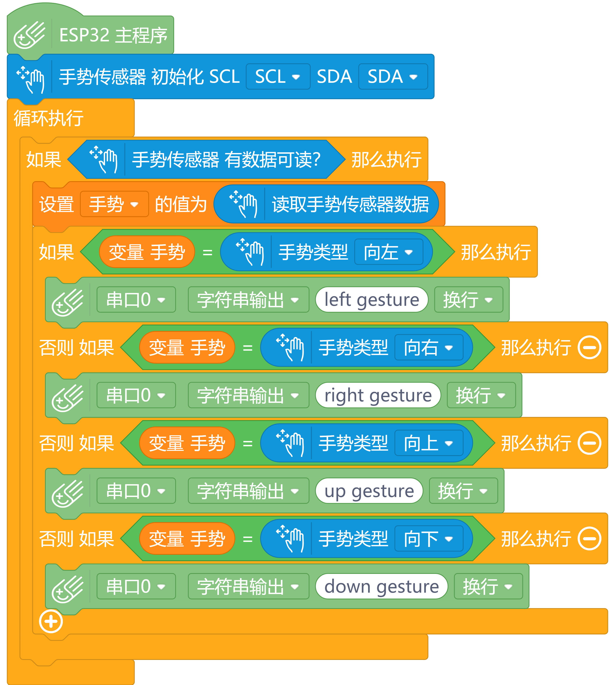

# 手势识别传感器（APDS-9960） Mind+ 用户库

## 简介 Introduction

本扩展库为 APDS-9960 手势识别传感器设计。支持 Mind+ 导入库，**要求 Mind+ 软件版本为 1.6.2 及以上**。

APDS-9960 手势识别传感器能够识别你手的运动方向，可以作为各种开关的触发装置，来帮助你实现智能控制。此外它还是一个颜色和光强传感器，可以分辨 RGB 三基色的各类组合。 模块采用了 APDS-9960 传感器，集成 RGB、环境光、近程和手势传感器模块。I2C 接口保证了它的可使用性，近程和手势检测配有红外 LED。RGB 和环境光检测功能可在多种光条件下以及通过多种减振材料包括深色玻璃的情况下，检测出光强度。此外，集成 UV-IR 遮光滤光片可实现精准的环境光和相关色温检测。着实是一款非常棒的传感器！

注意：目前本用户库只设计了手势识别相关功能。RGB、环境光检测功能暂未加入。

## 链接 Links

- **本用户库加载地址：**

  GitHub：[https://github.com/chenzhongxian/ext-fingerprint](https://github.com/chenzhongxian/ext-fingerprint)

  或：码云（推荐国内用户使用）：[https://gitee.com/ironpanda/ext-fingerprint](https://gitee.com/ironpanda/ext-fingerprint) 

- **Mind+ 软件下载地址：**[http://mindplus.cc](http://mindplus.cc)

- **指纹传感器 Arduino 库地址：**[https://github.com/adafruit/Adafruit_APDS9960](https://github.com/adafruit/Adafruit_APDS9960)

- **产品购买推荐链接**：[https://www.dfrobot.com.cn/goods-1191.html](https://www.dfrobot.com.cn/goods-1191.html)

## 图形模块 Blocks

Mind+ 模块：

## 示例程序 Examples

## License

MIT

## 硬件支持 Hardware Support

- 掌控板
- Arduino Uno
- Arduino Nano
- Arduino Leonardo
- Arduino Mega2560

## 更新日志 Release Note

- V0.1.0，20200331，第一版发布

